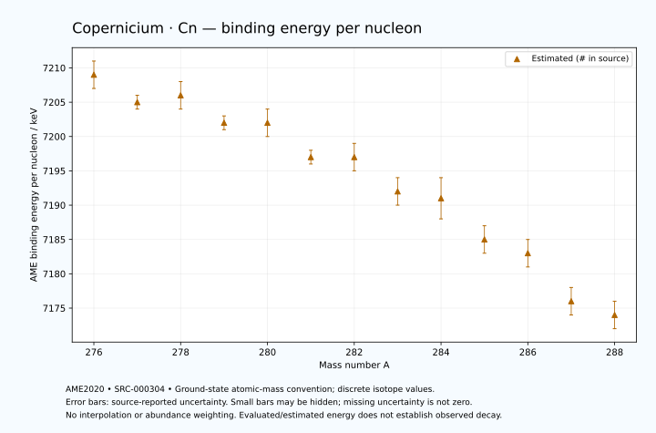

# Copernicium — Atomic Masses and Reaction Energies

<!-- generated-by: sync-ame2020.mjs -->

**Dated evaluated data · scientific coverage remains partial.** 13 ground-state nuclides from AME2020. Values and uncertainties are transcribed from the retained unrounded analysis files; estimated quantities remain labelled.

- [Parent Copernicium record](0112-Copernicium-Cn.md) · [NUBASE states and decays](0112-Copernicium-Cn-Nuclear-Evaluation.md)
- [Structured data](data/isotopes/0112-Copernicium-Cn-AME2020-Evaluation.yaml)
- [Original mass table](../../data/catalog/sources/ame2020-mass_1.mas20.txt) · [Original reaction table 1](../../data/catalog/sources/ame2020-rct1.mas20.txt) · [Original reaction table 2](../../data/catalog/sources/ame2020-rct2.mas20.txt)
- [AME2020 methods](https://doi.org/10.1088/1674-1137/abddb0) (SRC-000303) · [Tables and definitions](https://doi.org/10.1088/1674-1137/abddaf) (SRC-000304)

## Reading the data

All table energies and uncertainties are in keV; binding energy is per nucleon. A # replaces a decimal point in the original estimated value. UNKNOWN (*) retains the source's not-calculable entry; it is neither zero nor automatically NOT APPLICABLE. Source lines are one-based in the retained files. Uncertainties remain those published by the evaluation, with no replacement by independent-mass quadrature.

Atomic-mass conventions apply. Qα is total decay energy, not alpha-particle kinetic energy. Positive Q alone does not establish a decay branch, rate or observation. He-4's source Qα of zero is a bookkeeping identity. These tables describe ground-state combinations, not isomer or excited-daughter transitions. Nuclear state and daughter lookups are explicit in the structured companion. The binding quantity follows [Z M(¹H) + N mₙ − M(A,Z)]c²/A; it has not been converted to a bare-nucleus convention.

## Mass and binding table

| Nuclide | N | Atomic mass excess / keV | AME binding per nucleon / keV | Mass-file line |
|---|---:|---|---|---:|
| Cn-276 | 164 | 150360# ± 500# | 7209# ± 2# | 3513 |
| Cn-277 | 165 | 152332# ± 153# | 7205# ± 1# | 3519 |
| Cn-278 | 166 | 152842# ± 438# | 7206# ± 2# | 3525 |
| Cn-279 | 167 | 155021# ± 395# | 7202# ± 1# | 3531 |
| Cn-280 | 168 | 155654# ± 583# | 7202# ± 2# | 3537 |
| Cn-281 | 169 | 157947# ± 397# | 7197# ± 1# | 3542 |
| Cn-282 | 170 | 158826# ± 548# | 7197# ± 2# | 3547 |
| Cn-283 | 171 | 161337# ± 615# | 7192# ± 2# | 3551 |
| Cn-284 | 172 | 162415# ± 762# | 7191# ± 3# | 3555 |
| Cn-285 | 173 | 165086# ± 507# | 7185# ± 2# | 3559 |
| Cn-286 | 174 | 166450# ± 700# | 7183# ± 2# | 3563 |
| Cn-287 | 175 | 169370# ± 700# | 7176# ± 2# | 3566 |
| Cn-288 | 176 | 170930# ± 700# | 7174# ± 2# | 3570 |

## Q-values and separation energies

| Nuclide | Qβ− / keV | Qα / keV | S₂n / keV | S₂p / keV | Reaction-file line |
|---|---|---|---|---|---:|
| Cn-276 | UNKNOWN (*) | 11852# ± 656# | UNKNOWN (*) | 3415# ± 634# | 3512 |
| Cn-277 | UNKNOWN (*) | 11622.1999 ± 58.3095 | UNKNOWN (*) | 3912# ± 373# | 3518 |
| Cn-278 | -6188# ± 491# | 11220# ± 200# | 13661# ± 665# | 4275# ± 701# | 3524 |
| Cn-279 | -4439# ± 718# | 10930# ± 200# | 13454# ± 424# | 4649# ± 557# | 3530 |
| Cn-280 | -5585# ± 707# | 10690# ± 200# | 13330# ± 729# | 5175# ± 775# | 3536 |
| Cn-281 | -3863# ± 498# | 10429.9999 ± 64.0312 | 13216# ± 560# | 5655# ± 724# | 3541 |
| Cn-282 | -4903# ± 678# | 10150# ± 200# | 12971# ± 800# | 6072# ± 927# | 3546 |
| Cn-283 | -3226# ± 754# | 9888# ± 113# | 12753# ± 732# | 6514# ± 788# | 3550 |
| Cn-284 | -4176# ± 931# | 9670# ± 150# | 12553# ± 939# | 6953# ± 819# | 3554 |
| Cn-285 | -2682# ± 926# | 9388# ± 116# | 12393# ± 797# | 7321# ± 712# | 3558 |
| Cn-286 | -3507# ± 915# | 9235# ± 761# | 12108# ± 1035# | 7588# ± 860# | 3562 |
| Cn-287 | -2085# ± 995# | 9115# ± 860# | 11859# ± 864# | UNKNOWN (*) | 3565 |
| Cn-288 | -3039# ± 989# | 9046# ± 860# | 11662# ± 989# | UNKNOWN (*) | 3569 |

## Additional decay-energy combinations

| Nuclide | Q₂β− / keV | Q₄β− / keV | Qεp / keV | Qβ−n / keV | Part 1 / part 2 line |
|---|---|---|---|---|---|
| Cn-276 | UNKNOWN (*) | UNKNOWN (*) | 1405# ± 605# | UNKNOWN (*) | 3512 / 3562 |
| Cn-277 | UNKNOWN (*) | UNKNOWN (*) | 2504# ± 569# | UNKNOWN (*) | 3518 / 3568 |
| Cn-278 | UNKNOWN (*) | UNKNOWN (*) | 461# ± 588# | UNKNOWN (*) | 3524 / 3574 |
| Cn-279 | UNKNOWN (*) | UNKNOWN (*) | 1481# ± 645# | -12080# ± 454# | 3530 / 3580 |
| Cn-280 | UNKNOWN (*) | UNKNOWN (*) | -659# ± 840# | -11877# ± 837# | 3536 / 3586 |
| Cn-281 | UNKNOWN (*) | UNKNOWN (*) | 338# ± 847# | -11364# ± 564# | 3541 / 3591 |
| Cn-282 | UNKNOWN (*) | UNKNOWN (*) | -1736# ± 737# | -11055# ± 625# | 3546 / 3596 |
| Cn-283 | UNKNOWN (*) | UNKNOWN (*) | -742# ± 684# | -10463# ± 734# | 3550 / 3600 |
| Cn-284 | -6364# ± 1006# | UNKNOWN (*) | -2703# ± 912# | -10219# ± 879# | 3554 / 3604 |
| Cn-285 | -5846# ± 648# | UNKNOWN (*) | -1662# ± 712# | -9576# ± 736# | 3558 / 3608 |
| Cn-286 | -5156# ± 889# | UNKNOWN (*) | UNKNOWN (*) | -9390# ± 1044# | 3562 / 3612 |
| Cn-287 | -4559# ± 933# | UNKNOWN (*) | UNKNOWN (*) | -8658# ± 915# | 3565 / 3615 |
| Cn-288 | -3987# ± 1035# | UNKNOWN (*) | UNKNOWN (*) | -8596# ± 995# | 3569 / 3619 |

## Single-nucleon separation and reaction energies

| Nuclide | Sₙ / keV | Sₚ / keV | Q(d,α) / keV | Q(p,α) / keV | Q(n,α) / keV | Part 2 line |
|---|---|---|---|---|---|---:|
| Cn-276 | UNKNOWN (*) | 2324# ± 670# | 16459# ± 542# | 12339# ± 640# | 17721# ± 520# | 3562 |
| Cn-277 | 6099# ± 523# | 2343# ± 647# | 17648# ± 472# | 12585# ± 259# | 18782# ± 418# | 3568 |
| Cn-278 | 7562# ± 464# | 2854# ± 641# | 16166# ± 766# | 12311# ± 625# | 16822# ± 554# | 3574 |
| Cn-279 | 5892# ± 589# | 2789# ± 554# | 17325# ± 613# | 12498# ± 743# | 18128# ± 675# | 3580 |
| Cn-280 | 7438# ± 704# | 3356# ± 720# | 15845# ± 701# | 12111# ± 748# | 16209# ± 703# | 3586 |
| Cn-281 | 5779# ± 706# | 3228# ± 664# | 16936# ± 580# | 12291# ± 556# | 17343# ± 647# | 3591 |
| Cn-282 | 7193# ± 677# | 3796# ± 948# | 15651# ± 764# | 11968# ± 692# | 15448# ± 816# | 3596 |
| Cn-283 | 5560# ± 824# | 3694# ± 851# | 16715# ± 989# | 12315# ± 813# | 16663# ± 968# | 3600 |
| Cn-284 | 6993# ± 980# | 4254# ± 1020# | 15384# ± 963# | 11946# ± 1086# | 14789# ± 908# | 3604 |
| Cn-285 | 5400# ± 915# | 4173# ± 712# | 16417# ± 846# | 12209# ± 776# | 15943# ± 589# | 3608 |
| Cn-286 | 6708# ± 864# | 4569# ± 922# | 15190# ± 860# | 11934# ± 974# | 14266# ± 860# | 3612 |
| Cn-287 | 5151# ± 989# | 4429# ± 836# | 16351# ± 922# | 12264# ± 860# | 15557# ± 860# | 3615 |
| Cn-288 | 6511# ± 989# | UNKNOWN (*) | 15131# ± 836# | 12065# ± 922# | UNKNOWN (*) | 3619 |

Qβ− comes from the mass-file line in the first table. Qα, S₂n, S₂p, Q₂β−, Qεp and Qβ−n come from reaction part 1; Q₄β− and the last table come from part 2. Qεp is electron-capture/proton energy balance; Qβ−n is beta-minus/neutron energy balance. These are evaluated mass combinations, not observations of decay modes, cross sections or reaction rates. Light-nuclide zero entries can be bookkeeping identities, without a physical A=0 residual. Definitions and original source strings are retained in the structured data.

## Binding-energy chart

Discrete source values and source-reported uncertainties. No interpolation, natural-abundance weighting or observed-decay claim is implied. This quantitative chart supplements the 22 separate illustrative panels.

## Remaining review

Later measurements, state-specific decay branches, isomer Q-values, reaction rates, applicability and full claim-level review remain open. Existing authored values retain their own provenance; this companion does not overwrite them.
