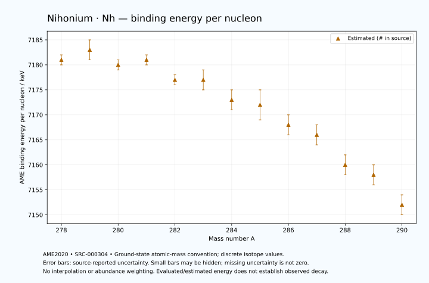

# Nihonium — Atomic Masses and Reaction Energies

<!-- generated-by: sync-ame2020.mjs -->

**Dated evaluated data · scientific coverage remains partial.** 13 ground-state nuclides from AME2020. Values and uncertainties are transcribed from the retained unrounded analysis files; estimated quantities remain labelled.

- [Parent Nihonium record](0113-Nihonium-Nh.md) · [NUBASE states and decays](0113-Nihonium-Nh-Nuclear-Evaluation.md)
- [Structured data](data/isotopes/0113-Nihonium-Nh-AME2020-Evaluation.yaml)
- [Original mass table](../../data/catalog/sources/ame2020-mass_1.mas20.txt) · [Original reaction table 1](../../data/catalog/sources/ame2020-rct1.mas20.txt) · [Original reaction table 2](../../data/catalog/sources/ame2020-rct2.mas20.txt)
- [AME2020 methods](https://doi.org/10.1088/1674-1137/abddb0) (SRC-000303) · [Tables and definitions](https://doi.org/10.1088/1674-1137/abddaf) (SRC-000304)

## Reading the data

All table energies and uncertainties are in keV; binding energy is per nucleon. A # replaces a decimal point in the original estimated value. UNKNOWN (*) retains the source's not-calculable entry; it is neither zero nor automatically NOT APPLICABLE. Source lines are one-based in the retained files. Uncertainties remain those published by the evaluation, with no replacement by independent-mass quadrature.

Atomic-mass conventions apply. Qα is total decay energy, not alpha-particle kinetic energy. Positive Q alone does not establish a decay branch, rate or observation. He-4's source Qα of zero is a bookkeeping identity. These tables describe ground-state combinations, not isomer or excited-daughter transitions. Nuclear state and daughter lookups are explicit in the structured companion. The binding quantity follows [Z M(¹H) + N mₙ − M(A,Z)]c²/A; it has not been converted to a bare-nucleus convention.

## Mass and binding table

| Nuclide | N | Atomic mass excess / keV | AME binding per nucleon / keV | Mass-file line |
|---|---:|---|---|---:|
| Nh-278 | 165 | 159030# ± 224# | 7181# ± 1# | 3526 |
| Nh-279 | 166 | 159460# ± 600# | 7183# ± 2# | 3532 |
| Nh-280 | 167 | 161240# ± 400# | 7180# ± 1# | 3538 |
| Nh-281 | 168 | 161810# ± 300# | 7181# ± 1# | 3543 |
| Nh-282 | 169 | 163729# ± 400# | 7177# ± 1# | 3548 |
| Nh-283 | 170 | 164563# ± 437# | 7177# ± 2# | 3552 |
| Nh-284 | 171 | 166591# ± 533# | 7173# ± 2# | 3556 |
| Nh-285 | 172 | 167768# ± 775# | 7172# ± 3# | 3560 |
| Nh-286 | 173 | 169957# ± 590# | 7168# ± 2# | 3564 |
| Nh-287 | 174 | 171455# ± 707# | 7166# ± 2# | 3567 |
| Nh-288 | 175 | 173970# ± 700# | 7160# ± 2# | 3571 |
| Nh-289 | 176 | 175550# ± 500# | 7158# ± 2# | 3574 |
| Nh-290 | 177 | 178315# ± 469# | 7152# ± 2# | 3578 |

## Q-values and separation energies

| Nuclide | Qβ− / keV | Qα / keV | S₂n / keV | S₂p / keV | Reaction-file line |
|---|---|---|---|---|---:|
| Nh-278 | UNKNOWN (*) | 11992.7999 ± 78.8733 | UNKNOWN (*) | 2935# ± 668# | 3525 |
| Nh-279 | UNKNOWN (*) | 11640# ± 748# | UNKNOWN (*) | 3525# ± 761# | 3531 |
| Nh-280 | UNKNOWN (*) | 11428# ± 745# | 13932# ± 458# | 3859# ± 557# | 3537 |
| Nh-281 | UNKNOWN (*) | 10978# ± 557# | 13792# ± 671# | 4490# ± 518# | 3542 |
| Nh-282 | UNKNOWN (*) | 10783.1999 ± 95.3595 | 13654# ± 565# | 4735# ± 666# | 3547 |
| Nh-283 | UNKNOWN (*) | 10417# ± 112# | 13389# ± 530# | 5348# ± 889# | 3551 |
| Nh-284 | -2188# ± 845# | 10280.0027 ± 38.1184 | 13280# ± 667# | 5729# ± 794# | 3555 |
| Nh-285 | -3164# ± 874# | 10009.9999 ± 40.0000 | 12938# ± 890# | 6190# ± 1030# | 3559 |
| Nh-286 | -1649# ± 806# | 9789.9999 ± 50.0000 | 12777# ± 796# | 6591# ± 774# | 3563 |
| Nh-287 | -2474# ± 939# | 9650# ± 200# | 12456# ± 1049# | 6853# ± 927# | 3566 |
| Nh-288 | -947# ± 1035# | 9575# ± 860# | 12130# ± 915# | 7119# ± 836# | 3570 |
| Nh-289 | -1915# ± 715# | 9396# ± 781# | 12047# ± 866# | UNKNOWN (*) | 3573 |
| Nh-290 | -416# ± 843# | 9380# ± 100# | 11797# ± 842# | UNKNOWN (*) | 3577 |

## Additional decay-energy combinations

| Nuclide | Q₂β− / keV | Q₄β− / keV | Qεp / keV | Qβ−n / keV | Part 1 / part 2 line |
|---|---|---|---|---|---|
| Nh-278 | UNKNOWN (*) | UNKNOWN (*) | 3334# ± 520# | UNKNOWN (*) | 3525 / 3575 |
| Nh-279 | UNKNOWN (*) | UNKNOWN (*) | 1650# ± 715# | UNKNOWN (*) | 3531 / 3581 |
| Nh-280 | UNKNOWN (*) | UNKNOWN (*) | 2229# ± 581# | UNKNOWN (*) | 3537 / 3587 |
| Nh-281 | UNKNOWN (*) | UNKNOWN (*) | 635# ± 611# | UNKNOWN (*) | 3542 / 3592 |
| Nh-282 | UNKNOWN (*) | UNKNOWN (*) | 1107# ± 871# | UNKNOWN (*) | 3547 / 3597 |
| Nh-283 | UNKNOWN (*) | UNKNOWN (*) | -468# ± 733# | UNKNOWN (*) | 3551 / 3601 |
| Nh-284 | UNKNOWN (*) | UNKNOWN (*) | -78# ± 863# | UNKNOWN (*) | 3555 / 3605 |
| Nh-285 | UNKNOWN (*) | UNKNOWN (*) | -1491# ± 922# | -9083# ± 1015# | 3559 / 3609 |
| Nh-286 | UNKNOWN (*) | UNKNOWN (*) | -1062# ± 842# | -9047# ± 715# | 3563 / 3613 |
| Nh-287 | -6293# ± 834# | UNKNOWN (*) | -2344# ± 842# | -8222# ± 895# | 3566 / 3616 |
| Nh-288 | -5696# ± 881# | UNKNOWN (*) | UNKNOWN (*) | -8030# ± 933# | 3570 / 3620 |
| Nh-289 | -5133# ± 924# | UNKNOWN (*) | UNKNOWN (*) | -7438# ± 912# | 3573 / 3623 |
| Nh-290 | -4476# ± 755# | UNKNOWN (*) | UNKNOWN (*) | -7222# ± 693# | 3577 / 3628 |

## Single-nucleon separation and reaction energies

| Nuclide | Sₙ / keV | Sₚ / keV | Q(d,α) / keV | Q(p,α) / keV | Q(n,α) / keV | Part 2 line |
|---|---|---|---|---|---|---:|
| Nh-278 | UNKNOWN (*) | 592# ± 271# | 19380# ± 548# | UNKNOWN (*) | 19281# ± 499# | 3575 |
| Nh-279 | 7641# ± 640# | 671# ± 742# | 17838# ± 619# | 13964# ± 781# | 17720# ± 869# | 3581 |
| Nh-280 | 6291# ± 721# | 1070# ± 562# | 19109# ± 593# | 13772# ± 428# | 18479# ± 616# | 3587 |
| Nh-281 | 7501# ± 500# | 1133# ± 656# | 17500# ± 496# | 13832# ± 530# | 16936# ± 491# | 3592 |
| Nh-282 | 6153# ± 500# | 1507# ± 564# | 18785# ± 707# | 13572# ± 562# | 17654# ± 582# | 3597 |
| Nh-283 | 7237# ± 592# | 1552# ± 701# | 17327# ± 591# | 13773# ± 729# | 16324# ± 688# | 3601 |
| Nh-284 | 6044# ± 689# | 2035# ± 814# | 18476# ± 765# | 13508# ± 665# | 16904# ± 940# | 3605 |
| Nh-285 | 6894# ± 941# | 1936# ± 1087# | 17142# ± 989# | 13806# ± 949# | 15673# ± 973# | 3609 |
| Nh-286 | 5883# ± 974# | 2419# ± 778# | 18252# ± 964# | 13484# ± 853# | 16223# ± 899# | 3613 |
| Nh-287 | 6573# ± 921# | 2284# ± 995# | 17079# ± 870# | 13904# ± 1040# | 15131# ± 866# | 3616 |
| Nh-288 | 5557# ± 995# | 2689# ± 989# | 18231# ± 989# | 13747# ± 864# | 15886# ± 922# | 3620 |
| Nh-289 | 6491# ± 860# | 2669# ± 860# | 16891# ± 860# | 13965# ± 860# | 14686# ± 678# | 3623 |
| Nh-290 | 5306# ± 685# | UNKNOWN (*) | 18096# ± 842# | 13809# ± 842# | UNKNOWN (*) | 3628 |

Qβ− comes from the mass-file line in the first table. Qα, S₂n, S₂p, Q₂β−, Qεp and Qβ−n come from reaction part 1; Q₄β− and the last table come from part 2. Qεp is electron-capture/proton energy balance; Qβ−n is beta-minus/neutron energy balance. These are evaluated mass combinations, not observations of decay modes, cross sections or reaction rates. Light-nuclide zero entries can be bookkeeping identities, without a physical A=0 residual. Definitions and original source strings are retained in the structured data.

## Binding-energy chart

Discrete source values and source-reported uncertainties. No interpolation, natural-abundance weighting or observed-decay claim is implied. This quantitative chart supplements the 22 separate illustrative panels.

## Remaining review

Later measurements, state-specific decay branches, isomer Q-values, reaction rates, applicability and full claim-level review remain open. Existing authored values retain their own provenance; this companion does not overwrite them.
