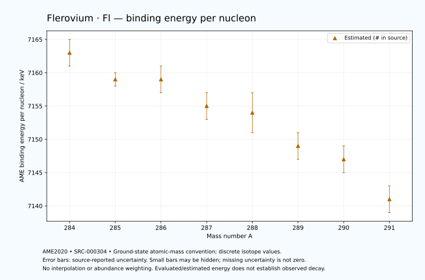

# Flerovium — Atomic Masses and Reaction Energies

<!-- generated-by: sync-ame2020.mjs -->

**Dated evaluated data · scientific coverage remains partial.** 8 ground-state nuclides from AME2020. Values and uncertainties are transcribed from the retained unrounded analysis files; estimated quantities remain labelled.

- [Parent Flerovium record](0114-Flerovium-Fl.md) · [NUBASE states and decays](0114-Flerovium-Fl-Nuclear-Evaluation.md)
- [Structured data](data/isotopes/0114-Flerovium-Fl-AME2020-Evaluation.yaml)
- [Original mass table](../../data/catalog/sources/ame2020-mass_1.mas20.txt) · [Original reaction table](../../data/catalog/sources/ame2020-rct1.mas20.txt)
- [AME2020 methods](https://doi.org/10.1088/1674-1137/abddb0) (SRC-000303) · [Tables and definitions](https://doi.org/10.1088/1674-1137/abddaf) (SRC-000304)

## Reading the data

All table energies and uncertainties are in keV; binding energy is per nucleon. A # replaces a decimal point in the original estimated value. UNKNOWN (*) retains the source's not-calculable entry; it is neither zero nor automatically NOT APPLICABLE. Source lines are one-based in the retained files. Uncertainties remain those published by the evaluation, with no replacement by independent-mass quadrature.

Atomic-mass conventions apply. Qα is total decay energy, not alpha-particle kinetic energy. Positive Q alone does not establish a decay branch, rate or observation. He-4's source Qα of zero is a bookkeeping identity. These tables describe ground-state combinations, not isomer or excited-daughter transitions. Nuclear state and daughter lookups are explicit in the structured companion. The binding quantity follows [Z M(¹H) + N mₙ − M(A,Z)]c²/A; it has not been converted to a bare-nucleus convention.

## Mass and binding table

| Nuclide | N | Atomic mass excess / keV | AME binding per nucleon / keV | Mass-file line |
|---|---:|---|---|---:|
| Fl-284 | 170 | 168779# ± 656# | 7163# ± 2# | 3557 |
| Fl-285 | 171 | 170932# ± 404# | 7159# ± 1# | 3561 |
| Fl-286 | 172 | 171606# ± 549# | 7159# ± 2# | 3565 |
| Fl-287 | 173 | 173929# ± 617# | 7155# ± 2# | 3568 |
| Fl-288 | 174 | 174917# ± 763# | 7154# ± 3# | 3572 |
| Fl-289 | 175 | 177465# ± 511# | 7149# ± 2# | 3575 |
| Fl-290 | 176 | 178731# ± 700# | 7147# ± 2# | 3579 |
| Fl-291 | 177 | 181500# ± 700# | 7141# ± 2# | 3582 |

## Q-values and separation energies

| Nuclide | Qβ− / keV | Qα / keV | S₂n / keV | S₂p / keV | Reaction-file line |
|---|---|---|---|---|---:|
| Fl-284 | UNKNOWN (*) | 10700# ± 300# | UNKNOWN (*) | 4625# ± 854# | 3556 |
| Fl-285 | UNKNOWN (*) | 10559.9999 ± 70.7107 | UNKNOWN (*) | 4983# ± 736# | 3560 |
| Fl-286 | UNKNOWN (*) | 10355.0663 ± 40.5683 | 13316# ± 855# | 5387# ± 940# | 3564 |
| Fl-287 | -3819# ± 759# | 10166.7999 ± 52.2594 | 13146# ± 738# | 5736# ± 799# | 3567 |
| Fl-288 | -4749# ± 932# | 10076.4873 ± 11.9330 | 12832# ± 940# | 6111# ± 1035# | 3571 |
| Fl-289 | -3217# ± 929# | 9954.1798 ± 65.3640 | 12606# ± 801# | 6482# ± 866# | 3574 |
| Fl-290 | -4061# ± 917# | 9856.1659 ± 30.4203 | 12329# ± 1035# | 6777# ± 990# | 3578 |
| Fl-291 | -2680# ± 1015# | 9705# ± 989# | 12108# ± 866# | UNKNOWN (*) | 3581 |

Qβ− comes from the mass-file line in the first table. The other three columns come from the reaction-file line. Definitions and original source strings are retained in the structured data.

## Binding-energy chart

Discrete source values and source-reported uncertainties. No interpolation, natural-abundance weighting or observed-decay claim is implied. This quantitative chart supplements the 22 separate illustrative panels.

## Remaining review

Later measurements, state-specific decay branches, isomer Q-values, additional reaction channels and full claim-level review remain open. Existing authored values retain their own provenance; this companion does not overwrite them.
