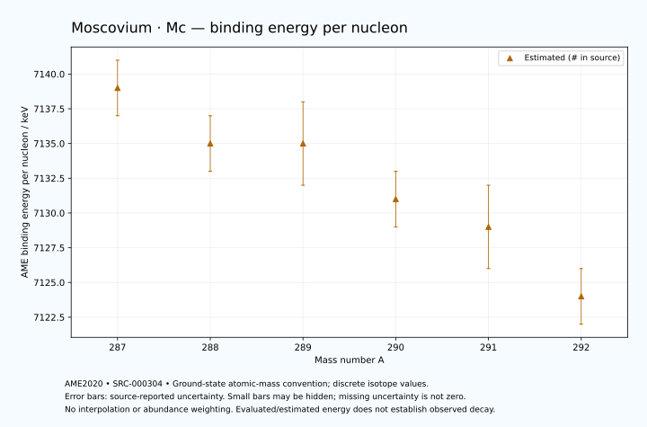

# Moscovium — Atomic Masses and Reaction Energies

<!-- generated-by: sync-ame2020.mjs -->

**Dated evaluated data · scientific coverage remains partial.** 6 ground-state nuclides from AME2020. Values and uncertainties are transcribed from the retained unrounded analysis files; estimated quantities remain labelled.

- [Parent Moscovium record](0115-Moscovium-Mc.md) · [NUBASE states and decays](0115-Moscovium-Mc-Nuclear-Evaluation.md)
- [Structured data](data/isotopes/0115-Moscovium-Mc-AME2020-Evaluation.yaml)
- [Original mass table](../../data/catalog/sources/ame2020-mass_1.mas20.txt) · [Original reaction table](../../data/catalog/sources/ame2020-rct1.mas20.txt)
- [AME2020 methods](https://doi.org/10.1088/1674-1137/abddb0) (SRC-000303) · [Tables and definitions](https://doi.org/10.1088/1674-1137/abddaf) (SRC-000304)

## Reading the data

All table energies and uncertainties are in keV; binding energy is per nucleon. A # replaces a decimal point in the original estimated value. UNKNOWN (*) retains the source's not-calculable entry; it is neither zero nor automatically NOT APPLICABLE. Source lines are one-based in the retained files. Uncertainties remain those published by the evaluation, with no replacement by independent-mass quadrature.

Atomic-mass conventions apply. Qα is total decay energy, not alpha-particle kinetic energy. Positive Q alone does not establish a decay branch, rate or observation. He-4's source Qα of zero is a bookkeeping identity. These tables describe ground-state combinations, not isomer or excited-daughter transitions. Nuclear state and daughter lookups are explicit in the structured companion. The binding quantity follows [Z M(¹H) + N mₙ − M(A,Z)]c²/A; it has not been converted to a bare-nucleus convention.

## Mass and binding table

| Nuclide | N | Atomic mass excess / keV | AME binding per nucleon / keV | Mass-file line |
|---|---:|---|---|---:|
| Mc-287 | 172 | 177748# ± 443# | 7139# ± 2# | 3569 |
| Mc-288 | 173 | 179666# ± 536# | 7135# ± 2# | 3573 |
| Mc-289 | 174 | 180683# ± 776# | 7135# ± 3# | 3576 |
| Mc-290 | 175 | 182792# ± 592# | 7131# ± 2# | 3580 |
| Mc-291 | 176 | 184180# ± 735# | 7129# ± 3# | 3583 |
| Mc-292 | 177 | 186600# ± 700# | 7124# ± 2# | 3586 |

## Q-values and separation energies

| Nuclide | Qβ− / keV | Qα / keV | S₂n / keV | S₂p / keV | Reaction-file line |
|---|---|---|---|---|---:|
| Mc-287 | UNKNOWN (*) | 10759.9999 ± 70.7107 | UNKNOWN (*) | 4598# ± 892# | 3568 |
| Mc-288 | UNKNOWN (*) | 10649.9999 ± 50.0000 | UNKNOWN (*) | 4869# ± 797# | 3572 |
| Mc-289 | -3774# ± 925# | 10489.9999 ± 50.0000 | 13208# ± 894# | 5350# ± 1050# | 3575 |
| Mc-290 | -2236# ± 809# | 10409.9999 ± 40.0000 | 13017# ± 798# | 5756# ± 916# | 3579 |
| Mc-291 | -3064# ± 964# | 10300# ± 200# | 12646# ± 1069# | 5948# ± 889# | 3582 |
| Mc-292 | -1533# ± 1035# | 10205# ± 989# | 12335# ± 916# | 6293# ± 842# | 3585 |

Qβ− comes from the mass-file line in the first table. The other three columns come from the reaction-file line. Definitions and original source strings are retained in the structured data.

## Binding-energy chart

Discrete source values and source-reported uncertainties. No interpolation, natural-abundance weighting or observed-decay claim is implied. This quantitative chart supplements the 22 separate illustrative panels.

## Remaining review

Later measurements, state-specific decay branches, isomer Q-values, additional reaction channels and full claim-level review remain open. Existing authored values retain their own provenance; this companion does not overwrite them.
