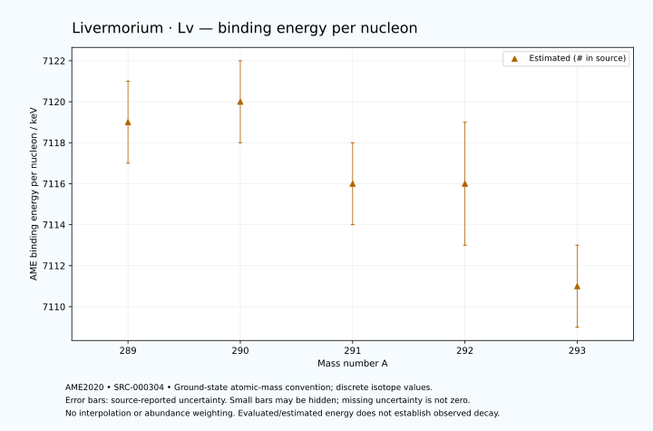

# Livermorium — Atomic Masses and Reaction Energies

<!-- generated-by: sync-ame2020.mjs -->

**Dated evaluated data · scientific coverage remains partial.** 5 ground-state nuclides from AME2020. Values and uncertainties are transcribed from the retained unrounded analysis files; estimated quantities remain labelled.

- [Parent Livermorium record](0116-Livermorium-Lv.md) · [NUBASE states and decays](0116-Livermorium-Lv-Nuclear-Evaluation.md)
- [Structured data](data/isotopes/0116-Livermorium-Lv-AME2020-Evaluation.yaml)
- [Original mass table](../../data/catalog/sources/ame2020-mass_1.mas20.txt) · [Original reaction table 1](../../data/catalog/sources/ame2020-rct1.mas20.txt) · [Original reaction table 2](../../data/catalog/sources/ame2020-rct2.mas20.txt)
- [AME2020 methods](https://doi.org/10.1088/1674-1137/abddb0) (SRC-000303) · [Tables and definitions](https://doi.org/10.1088/1674-1137/abddaf) (SRC-000304)

## Reading the data

All table energies and uncertainties are in keV; binding energy is per nucleon. A # replaces a decimal point in the original estimated value. UNKNOWN (*) retains the source's not-calculable entry; it is neither zero nor automatically NOT APPLICABLE. Source lines are one-based in the retained files. Uncertainties remain those published by the evaluation, with no replacement by independent-mass quadrature.

Atomic-mass conventions apply. Qα is total decay energy, not alpha-particle kinetic energy. Positive Q alone does not establish a decay branch, rate or observation. He-4's source Qα of zero is a bookkeeping identity. These tables describe ground-state combinations, not isomer or excited-daughter transitions. Nuclear state and daughter lookups are explicit in the structured companion. The binding quantity follows [Z M(¹H) + N mₙ − M(A,Z)]c²/A; it has not been converted to a bare-nucleus convention.

## Mass and binding table

| Nuclide | N | Atomic mass excess / keV | AME binding per nucleon / keV | Mass-file line |
|---|---:|---|---|---:|
| Lv-289 | 173 | 184457# ± 503# | 7119# ± 2# | 3577 |
| Lv-290 | 174 | 185028# ± 552# | 7120# ± 2# | 3581 |
| Lv-291 | 175 | 187244# ± 623# | 7116# ± 2# | 3584 |
| Lv-292 | 176 | 188133# ± 763# | 7116# ± 3# | 3587 |
| Lv-293 | 177 | 190568# ± 515# | 7111# ± 2# | 3589 |

## Q-values and separation energies

| Nuclide | Qβ− / keV | Qα / keV | S₂n / keV | S₂p / keV | Reaction-file line |
|---|---|---|---|---|---:|
| Lv-289 | UNKNOWN (*) | 11100# ± 300# | UNKNOWN (*) | 4050# ± 796# | 3576 |
| Lv-290 | UNKNOWN (*) | 10996.8334 ± 57.5862 | UNKNOWN (*) | 4467# ± 942# | 3580 |
| Lv-291 | -4409# ± 863# | 10889.9999 ± 86.0233 | 13356# ± 801# | 4800# ± 806# | 3583 |
| Lv-292 | -5488# ± 1014# | 10791.1897 ± 12.1669 | 13037# ± 942# | 5176# ± 1035# | 3586 |
| Lv-293 | -3860# ± 933# | 10677.3271 ± 64.3790 | 12819# ± 808# | 5510# ± 869# | 3588 |

## Additional decay-energy combinations

| Nuclide | Q₂β− / keV | Q₄β− / keV | Qεp / keV | Qβ−n / keV | Part 1 / part 2 line |
|---|---|---|---|---|---|
| Lv-289 | UNKNOWN (*) | UNKNOWN (*) | 2251# ± 913# | UNKNOWN (*) | 3576 / 3626 |
| Lv-290 | UNKNOWN (*) | UNKNOWN (*) | 273# ± 752# | UNKNOWN (*) | 3580 / 3631 |
| Lv-291 | UNKNOWN (*) | UNKNOWN (*) | 1224# ± 938# | UNKNOWN (*) | 3583 / 3634 |
| Lv-292 | UNKNOWN (*) | UNKNOWN (*) | -656# ± 1035# | -11592# ± 968# | 3586 / 3637 |
| Lv-293 | -8234# ± 876# | UNKNOWN (*) | UNKNOWN (*) | -11125# ± 844# | 3588 / 3639 |

## Single-nucleon separation and reaction energies

| Nuclide | Sₙ / keV | Sₚ / keV | Q(d,α) / keV | Q(p,α) / keV | Q(n,α) / keV | Part 2 line |
|---|---|---|---|---|---|---:|
| Lv-289 | UNKNOWN (*) | 2498# ± 735# | 17420# ± 670# | UNKNOWN (*) | 18498# ± 745# | 3626 |
| Lv-290 | 7501# ± 747# | 2944# ± 953# | 16072# ± 770# | 12143# ± 708# | 16745# ± 828# | 3631 |
| Lv-291 | 5855# ± 833# | 2837# ± 859# | 17272# ± 996# | 12442# ± 822# | 17973# ± 985# | 3634 |
| Lv-292 | 7182# ± 985# | 3336# ± 1059# | 16052# ± 965# | 12314# ± 1088# | 16314# ± 918# | 3637 |
| Lv-293 | 5636# ± 920# | 3321# ± 869# | 17099# ± 897# | 12640# ± 784# | 17483# ± 869# | 3639 |

Qβ− comes from the mass-file line in the first table. Qα, S₂n, S₂p, Q₂β−, Qεp and Qβ−n come from reaction part 1; Q₄β− and the last table come from part 2. Qεp is electron-capture/proton energy balance; Qβ−n is beta-minus/neutron energy balance. These are evaluated mass combinations, not observations of decay modes, cross sections or reaction rates. Light-nuclide zero entries can be bookkeeping identities, without a physical A=0 residual. Definitions and original source strings are retained in the structured data.

## Binding-energy chart

Discrete source values and source-reported uncertainties. No interpolation, natural-abundance weighting or observed-decay claim is implied. This quantitative chart supplements the 22 separate illustrative panels.

## Remaining review

Later measurements, state-specific decay branches, isomer Q-values, reaction rates, applicability and full claim-level review remain open. Existing authored values retain their own provenance; this companion does not overwrite them.
