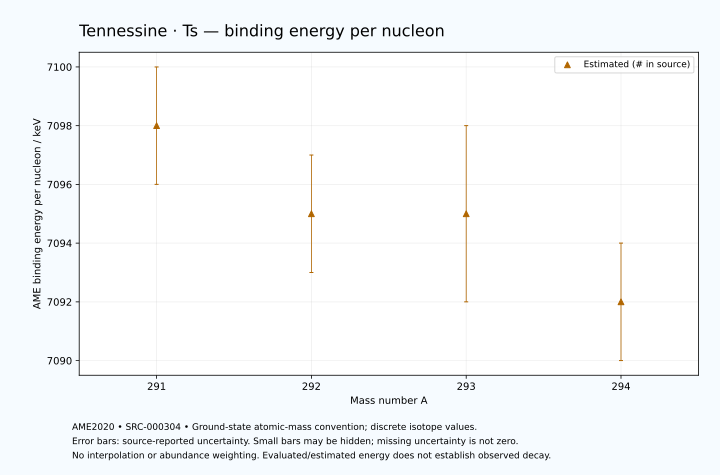

# Tennessine — Atomic Masses and Reaction Energies

<!-- generated-by: sync-ame2020.mjs -->

**Dated evaluated data · scientific coverage remains partial.** 4 ground-state nuclides from AME2020. Values and uncertainties are transcribed from the retained unrounded analysis files; estimated quantities remain labelled.

- [Parent Tennessine record](0117-Tennessine-Ts.md) · [NUBASE states and decays](0117-Tennessine-Ts-Nuclear-Evaluation.md)
- [Structured data](data/isotopes/0117-Tennessine-Ts-AME2020-Evaluation.yaml)
- [Original mass table](../../data/catalog/sources/ame2020-mass_1.mas20.txt) · [Original reaction table](../../data/catalog/sources/ame2020-rct1.mas20.txt)
- [AME2020 methods](https://doi.org/10.1088/1674-1137/abddb0) (SRC-000303) · [Tables and definitions](https://doi.org/10.1088/1674-1137/abddaf) (SRC-000304)

## Reading the data

All table energies and uncertainties are in keV; binding energy is per nucleon. A # replaces a decimal point in the original estimated value. UNKNOWN (*) retains the source's not-calculable entry; it is neither zero nor automatically NOT APPLICABLE. Source lines are one-based in the retained files. Uncertainties remain those published by the evaluation, with no replacement by independent-mass quadrature.

Atomic-mass conventions apply. Qα is total decay energy, not alpha-particle kinetic energy. Positive Q alone does not establish a decay branch, rate or observation. He-4's source Qα of zero is a bookkeeping identity. These tables describe ground-state combinations, not isomer or excited-daughter transitions. Nuclear state and daughter lookups are explicit in the structured companion. The binding quantity follows [Z M(¹H) + N mₙ − M(A,Z)]c²/A; it has not been converted to a bare-nucleus convention.

## Mass and binding table

| Nuclide | N | Atomic mass excess / keV | AME binding per nucleon / keV | Mass-file line |
|---|---:|---|---|---:|
| Ts-291 | 174 | 191653# ± 597# | 7098# ± 2# | 3585 |
| Ts-292 | 175 | 193621# ± 669# | 7095# ± 2# | 3588 |
| Ts-293 | 176 | 194428# ± 778# | 7095# ± 3# | 3590 |
| Ts-294 | 177 | 196397# ± 593# | 7092# ± 2# | 3592 |

## Q-values and separation energies

| Nuclide | Qβ− / keV | Qα / keV | S₂n / keV | S₂p / keV | Reaction-file line |
|---|---|---|---|---|---:|
| Ts-291 | UNKNOWN (*) | 11480# ± 400# | UNKNOWN (*) | 3608# ± 979# | 3584 |
| Ts-292 | UNKNOWN (*) | 11530# ± 400# | UNKNOWN (*) | 3749# ± 893# | 3587 |
| Ts-293 | -4374# ± 1053# | 11319.9999 ± 50.0000 | 13368# ± 980# | 4330# ± 1070# | 3589 |
| Ts-294 | -2923# ± 811# | 11179.9999 ± 40.0000 | 13367# ± 894# | 4781# ± 917# | 3591 |

Qβ− comes from the mass-file line in the first table. The other three columns come from the reaction-file line. Definitions and original source strings are retained in the structured data.

## Binding-energy chart

Discrete source values and source-reported uncertainties. No interpolation, natural-abundance weighting or observed-decay claim is implied. This quantitative chart supplements the 22 separate illustrative panels.

## Remaining review

Later measurements, state-specific decay branches, isomer Q-values, additional reaction channels and full claim-level review remain open. Existing authored values retain their own provenance; this companion does not overwrite them.
