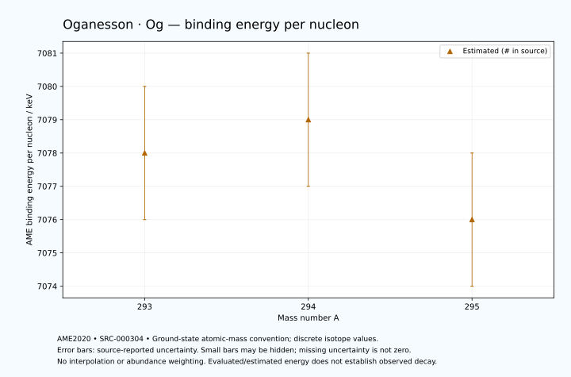

# Oganesson — Atomic Masses and Reaction Energies

<!-- generated-by: sync-ame2020.mjs -->

**Dated evaluated data · scientific coverage remains partial.** 3 ground-state nuclides from AME2020. Values and uncertainties are transcribed from the retained unrounded analysis files; estimated quantities remain labelled.

- [Parent Oganesson record](0118-Oganesson-Og.md) · [NUBASE states and decays](0118-Oganesson-Og-Nuclear-Evaluation.md)
- [Structured data](data/isotopes/0118-Oganesson-Og-AME2020-Evaluation.yaml)
- [Original mass table](../../data/catalog/sources/ame2020-mass_1.mas20.txt) · [Original reaction table 1](../../data/catalog/sources/ame2020-rct1.mas20.txt) · [Original reaction table 2](../../data/catalog/sources/ame2020-rct2.mas20.txt)
- [AME2020 methods](https://doi.org/10.1088/1674-1137/abddb0) (SRC-000303) · [Tables and definitions](https://doi.org/10.1088/1674-1137/abddaf) (SRC-000304)

## Reading the data

All table energies and uncertainties are in keV; binding energy is per nucleon. A # replaces a decimal point in the original estimated value. UNKNOWN (*) retains the source's not-calculable entry; it is neither zero nor automatically NOT APPLICABLE. Source lines are one-based in the retained files. Uncertainties remain those published by the evaluation, with no replacement by independent-mass quadrature.

Atomic-mass conventions apply. Qα is total decay energy, not alpha-particle kinetic energy. Positive Q alone does not establish a decay branch, rate or observation. He-4's source Qα of zero is a bookkeeping identity. These tables describe ground-state combinations, not isomer or excited-daughter transitions. Nuclear state and daughter lookups are explicit in the structured companion. The binding quantity follows [Z M(¹H) + N mₙ − M(A,Z)]c²/A; it has not been converted to a bare-nucleus convention.

## Mass and binding table

| Nuclide | N | Atomic mass excess / keV | AME binding per nucleon / keV | Mass-file line |
|---|---:|---|---|---:|
| Og-293 | 175 | 198802# ± 709# | 7078# ± 2# | 3591 |
| Og-294 | 176 | 199320# ± 553# | 7079# ± 2# | 3593 |
| Og-295 | 177 | 201369# ± 655# | 7076# ± 2# | 3594 |

## Q-values and separation energies

| Nuclide | Qβ− / keV | Qα / keV | S₂n / keV | S₂p / keV | Reaction-file line |
|---|---|---|---|---|---:|
| Og-293 | UNKNOWN (*) | 11920# ± 500# | UNKNOWN (*) | 3020# ± 944# | 3590 |
| Og-294 | UNKNOWN (*) | 11867.3266 ± 31.2963 | UNKNOWN (*) | 3391# ± 942# | 3592 |
| Og-295 | UNKNOWN (*) | 11700# ± 200# | 13576# ± 965# | 3777# ± 833# | 3593 |

## Additional decay-energy combinations

| Nuclide | Q₂β− / keV | Q₄β− / keV | Qεp / keV | Qβ−n / keV | Part 1 / part 2 line |
|---|---|---|---|---|---|
| Og-293 | UNKNOWN (*) | UNKNOWN (*) | 3380# ± 1041# | UNKNOWN (*) | 3590 / 3641 |
| Og-294 | UNKNOWN (*) | UNKNOWN (*) | 1463# ± 756# | UNKNOWN (*) | 3592 / 3643 |
| Og-295 | UNKNOWN (*) | UNKNOWN (*) | UNKNOWN (*) | UNKNOWN (*) | 3593 / 3644 |

## Single-nucleon separation and reaction energies

| Nuclide | Sₙ / keV | Sₚ / keV | Q(d,α) / keV | Q(p,α) / keV | Q(n,α) / keV | Part 2 line |
|---|---|---|---|---|---|---:|
| Og-293 | UNKNOWN (*) | 2108# ± 975# | 17860# ± 927# | UNKNOWN (*) | 19421# ± 899# | 3641 |
| Og-294 | 7553# ± 899# | 2397# ± 955# | 16410# ± 868# | 12531# ± 814# | 17723# ± 833# | 3643 |
| Og-295 | 6023# ± 857# | 2317# ± 883# | 17652# ± 1017# | 12612# ± 936# | 18882# ± 1005# | 3644 |

Qβ− comes from the mass-file line in the first table. Qα, S₂n, S₂p, Q₂β−, Qεp and Qβ−n come from reaction part 1; Q₄β− and the last table come from part 2. Qεp is electron-capture/proton energy balance; Qβ−n is beta-minus/neutron energy balance. These are evaluated mass combinations, not observations of decay modes, cross sections or reaction rates. Light-nuclide zero entries can be bookkeeping identities, without a physical A=0 residual. Definitions and original source strings are retained in the structured data.

## Binding-energy chart

Discrete source values and source-reported uncertainties. No interpolation, natural-abundance weighting or observed-decay claim is implied. This quantitative chart supplements the 22 separate illustrative panels.

## Remaining review

Later measurements, state-specific decay branches, isomer Q-values, reaction rates, applicability and full claim-level review remain open. Existing authored values retain their own provenance; this companion does not overwrite them.
